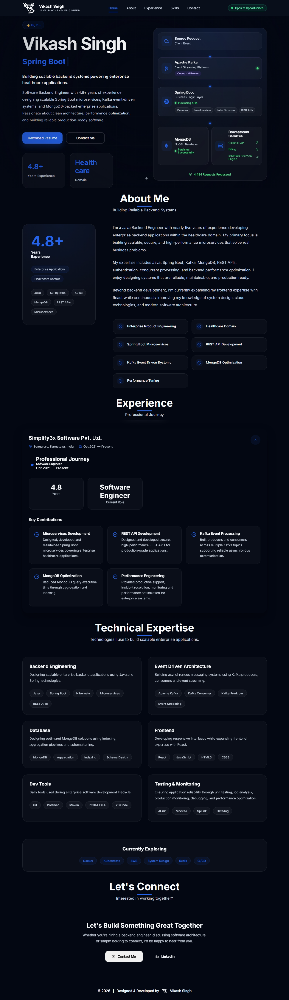

# 🚀 Personal Portfolio 

A modern, responsive personal portfolio built with **React + Vite** showcasing my experience as a Java Backend Engineer.

> Designed from scratch with a focus on clean UI, smooth animations, performance, and maintainable code.

---

## 🌐 Live Demo

🔗 https://vikash12singh.github.io

---

## 📸 Preview



---

# ✨ Features

- 🎨 Modern responsive UI
- 🌙 Dark theme by default
- 📱 Mobile-first responsive design
- ⚡ Smooth scrolling navigation
- 🎬 Framer Motion animations
- ⌨️ Typewriter hero section
- 📊 Interactive Backend Architecture visualization
- 🧩 Reusable component architecture
- 📄 Resume download
- 📈 Lighthouse optimized
- 🚀 GitHub Pages deployment

---

# 🛠️ Tech Stack

### Frontend

- React
- Vite
- JavaScript (ES6+)
- CSS3
- Framer Motion

### Icons

- React Icons

### Deployment

- GitHub Pages

---

# 📂 Project Structure

```
src/
│
├── assets/
├── components/
├── config/
├── context/
├── data/
├── hooks/
├── layout/
├── pages/
├── routes/
├── sections/
├── styles/
├── utils/
│
├── App.jsx
└── main.jsx
```

---

# 🚀 Getting Started

Clone the repository

```bash
git clone https://github.com/Vikash12Singh/Vikash12Singh.github.io
```

Navigate into the project

Install dependencies

```bash
npm install
```

Start development server

```bash
npm run dev
```

Build for production

```bash
npm run build
```

Preview production build

```bash
npm run preview
```

---

# 📱 Responsive Design

The portfolio is optimized for:

- Desktop
- Laptop
- Tablet
- Mobile

---

# ⚙️ Performance

The production build is optimized for:

- Fast loading
- Code splitting
- Tree shaking
- Optimized assets
- Lighthouse friendly performance

---

# 🎯 Sections

- Home
- About
- Experience
- Skills
- Contact

---

# 📄 Resume

The latest version of my resume can be downloaded directly from the portfolio.

---

# 👨‍💻 About Me

I'm a Java Backend Engineer with experience in

- Java
- Spring Boot
- Kafka
- MongoDB
- Microservices
- REST APIs
- Performance Optimization

Currently expanding my frontend expertise with React while building modern full-stack applications.

---

# 🤝 Connect with Me

### LinkedIn

https://www.linkedin.com/in/vs-vikashsingh/

### GitHub

https://github.com/Vikash12Singh

---

# 📜 License

This project is open source and available under the MIT License.

---

## ⭐ If you like this project, consider giving it a star!